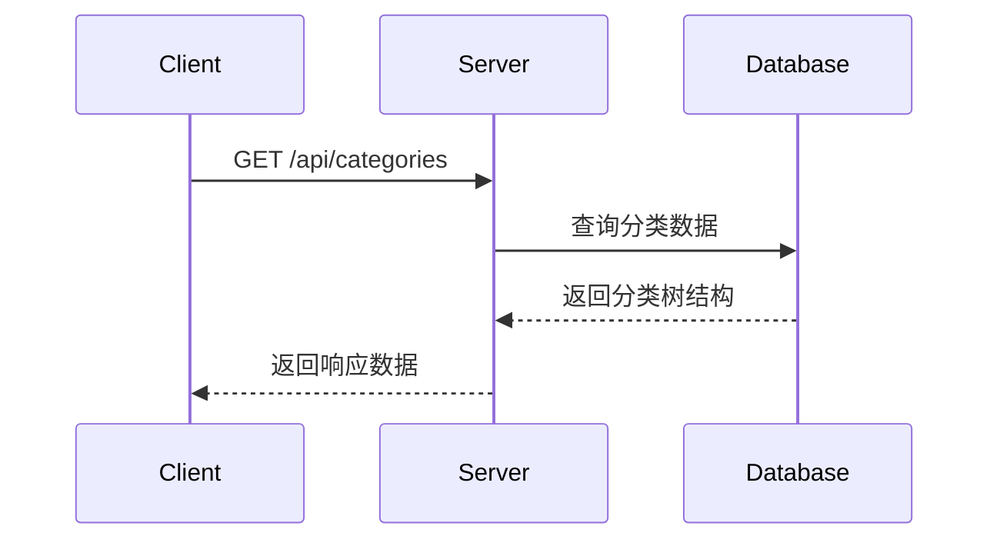

# 分类管理接口

## 获取分类列表

**接口名称：** 获取分类列表  
**功能描述：** 获取所有文档分类，包含层级结构  
**接口地址：** `/api/categories`  
**请求方式：** GET

### 功能说明

获取系统中所有的文档分类，返回树形结构数据，包含父子关系。用于分类树展示、分类选择器等场景。



### 请求参数

无

### 响应参数

**成功响应示例：**
```json
{
  "code": 200,
  "msg": "success",
  "data": [
    {
      "id": "cat_1",
      "name": "机器学习",
      "parent_id": null,
      "created_at": "2024-01-15T10:30:00Z",
      "document_count": 15,
      "children": [
        {
          "id": "cat_1_1",
          "name": "深度学习",
          "parent_id": "cat_1",
          "created_at": "2024-01-16T09:20:00Z",
          "document_count": 8,
          "children": []
        },
        {
          "id": "cat_1_2",
          "name": "强化学习",
          "parent_id": "cat_1",
          "created_at": "2024-01-17T14:45:00Z",
          "document_count": 7,
          "children": []
        }
      ]
    }
  ]
}
```

**错误响应示例：**
```json
{
  "code": 500,
  "msg": "服务器内部错误",
  "data": null
}
```

**响应字段说明：**

| 参数名 | 类型 | 必填 | 说明 | 示例值 |
|-------|------|-----|------|--------|
| code | int | 是 | 状态码 | 200 |
| msg | string | 是 | 状态信息 | "success" |
| data | array | 是 | 分类列表数据 | [] |
| data[].id | string | 是 | 分类唯一标识 | "cat_1" |
| data[].name | string | 是 | 分类名称 | "机器学习" |
| data[].parent_id | string | 否 | 父分类ID，null表示根分类 | null |
| data[].created_at | string | 是 | 创建时间（ISO格式） | "2024-01-15T10:30:00Z" |
| data[].document_count | int | 是 | 该分类下的文档数量 | 15 |
| data[].children | array | 否 | 子分类列表 | [] |

### 接口权限要求
- 需要用户登录
- 无特殊权限限制

### 接口调用频率限制
- 每分钟最多50次请求

---

## 创建分类

**接口名称：** 创建分类  
**功能描述：** 创建新的文档分类  
**接口地址：** `/api/categories`  
**请求方式：** POST

### 功能说明

创建新的文档分类，支持创建根分类和子分类。分类名称在同级别下必须唯一。

### 请求参数

**请求体参数：**
```json
{
  "name": "计算机视觉",
  "parent_id": "cat_1"
}
```

| 参数名 | 类型 | 必填 | 说明 | 示例值 |
|-------|------|-----|------|--------|
| name | string | 是 | 分类名称，长度1-50字符 | "计算机视觉" |
| parent_id | string | 否 | 父分类ID，不传表示创建根分类 | "cat_1" |

### 响应参数

**成功响应示例：**
```json
{
  "code": 200,
  "msg": "success",
  "data": {
    "id": "cat_123456789",
    "name": "计算机视觉",
    "parent_id": "cat_1",
    "created_at": "2024-01-21T10:30:00Z",
    "document_count": 0
  }
}
```

**错误响应示例：**
```json
{
  "code": 409,
  "msg": "分类名称已存在",
  "data": null
}
```

**响应字段说明：**

| 参数名 | 类型 | 必填 | 说明 | 示例值 |
|-------|------|-----|------|--------|
| code | int | 是 | 状态码 | 200 |
| msg | string | 是 | 状态信息 | "success" |
| data | object | 是 | 创建的分类信息 | {} |
| data.id | string | 是 | 分类唯一标识 | "cat_123456789" |
| data.name | string | 是 | 分类名称 | "计算机视觉" |
| data.parent_id | string | 否 | 父分类ID | "cat_1" |
| data.created_at | string | 是 | 创建时间 | "2024-01-21T10:30:00Z" |
| data.document_count | int | 是 | 文档数量 | 0 |

### 接口权限要求
- 需要用户登录
- 需要分类管理权限

### 接口调用频率限制
- 每分钟最多10次请求

---

## 更新分类

**接口名称：** 更新分类  
**功能描述：** 更新分类信息  
**接口地址：** `/api/categories/{id}`  
**请求方式：** POST

### 功能说明

更新指定分类的名称或父分类。不能将分类设置为自己的子分类，避免循环引用。

### 请求参数

**路径参数：**

| 参数名 | 类型 | 必填 | 说明 | 示例值 |
|-------|------|-----|------|--------|
| id | string | 是 | 分类ID | "cat_1" |

**请求体参数：**
```json
{
  "name": "人工智能",
  "parent_id": null
}
```

| 参数名 | 类型 | 必填 | 说明 | 示例值 |
|-------|------|-----|------|--------|
| name | string | 是 | 分类名称，长度1-50字符 | "人工智能" |
| parent_id | string | 否 | 父分类ID，null表示设为根分类 | null |

### 响应参数

**成功响应示例：**
```json
{
  "code": 200,
  "msg": "success",
  "data": {
    "id": "cat_1",
    "name": "人工智能",
    "parent_id": null,
    "created_at": "2024-01-15T10:30:00Z",
    "document_count": 15
  }
}
```

**错误响应示例：**
```json
{
  "code": 400,
  "msg": "不能将分类设置为自己的子分类",
  "data": null
}
```

### 接口权限要求
- 需要用户登录
- 需要分类管理权限

---

## 删除分类

**接口名称：** 删除分类  
**功能描述：** 删除指定分类（需要先移动或删除分类下的文档）  
**接口地址：** `/api/categories/{id}/delete`  
**请求方式：** POST

### 功能说明

删除指定的分类。如果分类下有文档或子分类，需要先处理这些数据才能删除。

### 请求参数

**路径参数：**

| 参数名 | 类型 | 必填 | 说明 | 示例值 |
|-------|------|-----|------|--------|
| id | string | 是 | 分类ID | "cat_1" |

### 响应参数

**成功响应示例：**
```json
{
  "code": 200,
  "msg": "success",
  "data": null
}
```

**错误响应示例：**
```json
{
  "code": 400,
  "msg": "分类下还有文档，请先移动或删除文档",
  "data": null
}
```

### 接口权限要求
- 需要用户登录
- 需要分类管理权限

### 相关业务规则说明
- 分类下有文档时不能删除
- 分类下有子分类时不能删除
- 系统默认分类不能删除
- 删除操作不可恢复