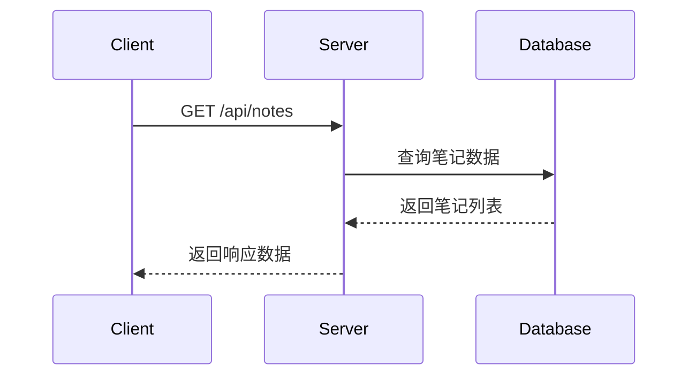

# 笔记管理接口

## 获取笔记列表

**接口名称：** 获取笔记列表  
**功能描述：** 获取用户的笔记列表，支持按文档筛选  
**接口地址：** `/api/notes`  
**请求方式：** GET

### 功能说明

获取用户创建的笔记列表，可以获取全部笔记或指定文档的笔记。用于笔记管理页面、文档阅读页面的笔记展示等场景。



### 请求参数

| 参数名 | 类型 | 必填 | 说明 | 示例值 |
|-------|------|-----|------|--------|
| document_id | string | 否 | 文档ID，不传则获取全部笔记 | "doc_1" |
| page | int | 否 | 页码，从1开始（默认1） | 2 |
| pageSize | int | 否 | 每页数量（默认20，最大100） | 50 |

### 响应参数

**成功响应示例：**
```json
{
  "code": 200,
  "msg": "success",
  "data": [
    {
      "id": "note_1",
      "document_id": "doc_1",
      "title": "Transformer架构要点",
      "content": "Transformer完全基于注意力机制，摒弃了循环和卷积结构...",
      "page_number": 3,
      "created_at": "2024-01-20T10:30:00Z",
      "updated_at": "2024-01-20T10:30:00Z",
      "tags": ["transformer", "architecture"]
    }
  ]
}
```

**错误响应示例：**
```json
{
  "code": 400,
  "msg": "页码参数错误",
  "data": null
}
```

**响应字段说明：**

| 参数名 | 类型 | 必填 | 说明 | 示例值 |
|-------|------|-----|------|--------|
| code | int | 是 | 状态码 | 200 |
| msg | string | 是 | 状态信息 | "success" |
| data | array | 是 | 笔记列表数据 | [] |
| data[].id | string | 是 | 笔记唯一标识 | "note_1" |
| data[].document_id | string | 是 | 关联的文档ID | "doc_1" |
| data[].title | string | 是 | 笔记标题 | "Transformer架构要点" |
| data[].content | string | 是 | 笔记内容 | "Transformer完全基于..." |
| data[].page_number | int | 是 | 关联的页码 | 3 |
| data[].created_at | string | 是 | 创建时间（ISO格式） | "2024-01-20T10:30:00Z" |
| data[].updated_at | string | 是 | 更新时间（ISO格式） | "2024-01-20T10:30:00Z" |
| data[].tags | array | 是 | 标签列表 | ["transformer", "architecture"] |

### 接口权限要求
- 需要用户登录
- 只能查看自己的笔记

### 接口调用频率限制
- 每分钟最多100次请求

---

## 创建笔记

**接口名称：** 创建笔记  
**功能描述：** 创建新的笔记  
**接口地址：** `/api/notes`  
**请求方式：** POST

### 功能说明

为指定文档创建新的笔记，支持关联到具体页码。笔记可以包含文本内容和标签。

### 请求参数

**请求体参数：**
```json
{
  "document_id": "doc_1",
  "title": "重要概念总结",
  "content": "这一章节介绍了Transformer的核心思想...",
  "page_number": 5,
  "tags": ["重要", "概念"]
}
```

| 参数名 | 类型 | 必填 | 说明 | 示例值 |
|-------|------|-----|------|--------|
| document_id | string | 是 | 关联的文档ID | "doc_1" |
| title | string | 是 | 笔记标题，长度1-100字符 | "重要概念总结" |
| content | string | 是 | 笔记内容，最大10000字符 | "这一章节介绍了..." |
| page_number | int | 否 | 关联的页码，默认为1 | 5 |
| tags | array | 否 | 标签列表，最多10个标签 | ["重要", "概念"] |

### 响应参数

**成功响应示例：**
```json
{
  "code": 200,
  "msg": "success",
  "data": {
    "id": "note_123456789",
    "document_id": "doc_1",
    "title": "重要概念总结",
    "content": "这一章节介绍了Transformer的核心思想...",
    "page_number": 5,
    "created_at": "2024-01-21T10:30:00Z",
    "updated_at": "2024-01-21T10:30:00Z",
    "tags": ["重要", "概念"]
  }
}
```

**错误响应示例：**
```json
{
  "code": 404,
  "msg": "文档不存在",
  "data": null
}
```

### 接口权限要求
- 需要用户登录
- 只能为自己有权限的文档创建笔记

### 接口调用频率限制
- 每分钟最多20次请求

---

## 更新笔记

**接口名称：** 更新笔记  
**功能描述：** 更新笔记内容  
**接口地址：** `/api/notes/{id}`  
**请求方式：** POST

### 功能说明

更新指定笔记的标题、内容、页码或标签信息。

### 请求参数

**路径参数：**

| 参数名 | 类型 | 必填 | 说明 | 示例值 |
|-------|------|-----|------|--------|
| id | string | 是 | 笔记ID | "note_1" |

**请求体参数：**
```json
{
  "title": "更新后的标题",
  "content": "更新后的内容...",
  "page_number": 6,
  "tags": ["更新", "重要"]
}
```

| 参数名 | 类型 | 必填 | 说明 | 示例值 |
|-------|------|-----|------|--------|
| title | string | 否 | 笔记标题 | "更新后的标题" |
| content | string | 否 | 笔记内容 | "更新后的内容..." |
| page_number | int | 否 | 关联的页码 | 6 |
| tags | array | 否 | 标签列表 | ["更新", "重要"] |

### 响应参数

**成功响应示例：**
```json
{
  "code": 200,
  "msg": "success",
  "data": {
    "id": "note_1",
    "document_id": "doc_1",
    "title": "更新后的标题",
    "content": "更新后的内容...",
    "page_number": 6,
    "created_at": "2024-01-20T10:30:00Z",
    "updated_at": "2024-01-21T10:30:00Z",
    "tags": ["更新", "重要"]
  }
}
```

**错误响应示例：**
```json
{
  "code": 404,
  "msg": "笔记不存在",
  "data": null
}
```

### 接口权限要求
- 需要用户登录
- 只能更新自己的笔记

---

## 删除笔记

**接口名称：** 删除笔记  
**功能描述：** 删除指定的笔记  
**接口地址：** `/api/notes/{id}/delete`  
**请求方式：** POST

### 功能说明

删除指定的笔记。删除操作不可恢复。

### 请求参数

**路径参数：**

| 参数名 | 类型 | 必填 | 说明 | 示例值 |
|-------|------|-----|------|--------|
| id | string | 是 | 笔记ID | "note_1" |

### 响应参数

**成功响应示例：**
```json
{
  "code": 200,
  "msg": "success",
  "data": null
}
```

**错误响应示例：**
```json
{
  "code": 404,
  "msg": "笔记不存在",
  "data": null
}
```

### 接口权限要求
- 需要用户登录
- 只能删除自己的笔记

### 相关业务规则说明
- 删除操作不可恢复，请谨慎操作
- 删除笔记不会影响关联的文档