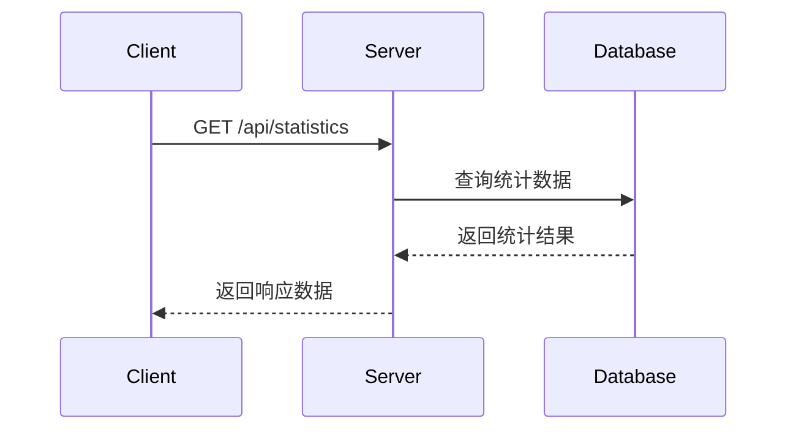

# 统计接口

## 获取统计数据

**接口名称：** 获取统计数据  
**功能描述：** 获取用户的各项统计数据  
**接口地址：** `/api/statistics`  
**请求方式：** GET

### 功能说明

获取用户在系统中的各项统计数据，包括文档数量、阅读进度、AI问答次数、笔记数量等。用于工作台统计面板展示。



### 请求参数

无

### 响应参数

**成功响应示例：**
```json
{
  "code": 200,
  "msg": "success",
  "data": {
    "totalDocuments": 25,
    "completedReading": 8,
    "aiQuestions": 156,
    "totalNotes": 48,
    "todayReading": 3,
    "weeklyReading": 12,
    "monthlyReading": 25,
    "averageReadingTime": 45,
    "favoriteCategories": [
      {
        "category_id": "cat_1",
        "category_name": "机器学习",
        "document_count": 12
      },
      {
        "category_id": "cat_2",
        "category_name": "自然语言处理",
        "document_count": 8
      }
    ],
    "recentActivity": [
      {
        "type": "upload",
        "description": "上传了《Attention Is All You Need》",
        "timestamp": "2024-01-21T10:30:00Z"
      },
      {
        "type": "complete",
        "description": "完成了《ResNet论文》的阅读",
        "timestamp": "2024-01-20T15:20:00Z"
      },
      {
        "type": "note",
        "description": "创建了5条新笔记",
        "timestamp": "2024-01-20T14:10:00Z"
      }
    ]
  }
}
```

**错误响应示例：**
```json
{
  "code": 500,
  "msg": "服务器内部错误",
  "data": null
}
```

**响应字段说明：**

| 参数名 | 类型 | 必填 | 说明 | 示例值 |
|-------|------|-----|------|--------|
| code | int | 是 | 状态码 | 200 |
| msg | string | 是 | 状态信息 | "success" |
| data | object | 是 | 统计数据 | {} |
| data.totalDocuments | int | 是 | 总文档数量 | 25 |
| data.completedReading | int | 是 | 已完成阅读的文档数量 | 8 |
| data.aiQuestions | int | 是 | AI问答总次数 | 156 |
| data.totalNotes | int | 是 | 笔记总数量 | 48 |
| data.todayReading | int | 是 | 今日阅读文档数 | 3 |
| data.weeklyReading | int | 是 | 本周阅读文档数 | 12 |
| data.monthlyReading | int | 是 | 本月阅读文档数 | 25 |
| data.averageReadingTime | int | 是 | 平均阅读时长（分钟） | 45 |
| data.favoriteCategories | array | 是 | 常用分类统计 | [] |
| data.favoriteCategories[].category_id | string | 是 | 分类ID | "cat_1" |
| data.favoriteCategories[].category_name | string | 是 | 分类名称 | "机器学习" |
| data.favoriteCategories[].document_count | int | 是 | 该分类下的文档数量 | 12 |
| data.recentActivity | array | 是 | 最近活动记录 | [] |
| data.recentActivity[].type | string | 是 | 活动类型：upload/complete/note/ai_chat | "upload" |
| data.recentActivity[].description | string | 是 | 活动描述 | "上传了《Attention Is All You Need》" |
| data.recentActivity[].timestamp | string | 是 | 活动时间（ISO格式） | "2024-01-21T10:30:00Z" |

### 接口权限要求
- 需要用户登录
- 只能查看自己的统计数据

### 接口调用频率限制
- 每分钟最多10次请求

### 相关业务规则说明
- 统计数据每小时更新一次
- 阅读完成度达到90%以上算作完成阅读
- 最近活动记录保留最近30条
- 常用分类按文档数量降序排列，最多返回5个