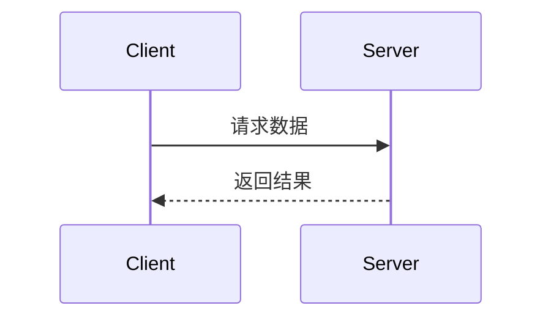

# 🧭 Web 前端（PC）开发规范汇总

## 🎯 技术栈约定
- **前端框架**：Vue 3（Composition API）
- **开发语言**：TypeScript（项目强制使用）
- **UI 组件库**：Element Plus（桌面端）
- **状态管理**：Pinia
- **构建工具**：Vite
- **样式**：SCSS + CSS Variables
- **图标库**：Element Plus Icons / FontAwesome
- **Mock 管理**：mockManager.ts（统一入口）
- **返回封装格式**：所有接口统一返回 `{ error, message, success, body }`

---

## 📁 项目结构（建议）
src/
├─ api/ # 所有接口文件（*.ts）
│ ├─ mockManager.ts # Mock接口注册中心
│ └─ index.ts # 统一导出API
├─ components/ # 通用组件（按模块分目录）
├─ views/ # 页面组件（以 View 结尾）
├─ router/ # 路由定义
├─ store/ # Pinia 状态模块
├─ assets/ # 静态资源（图片、fonts）
├─ styles/ # 全局样式 (SCSS, variables)
docs/ # API 文档与说明（md）
README.md


---

## 🔧 API 开发规范（必须遵守）
1. **文件位置与命名**：
   - API 文件放在 `src/api/`，命名采用 `模块名Api.ts`（例如 `UserApi.ts`）。
   - 统一导出入口 `src/api/index.ts`。

2. **注释规范**（JSDoc / TypeDoc 样式，示例）：
```ts
/**
 * 接口名称：获取用户列表
 * 功能描述：分页获取系统用户信息
 * 入参：{ page: number, pageSize: number }
 * 返回：{ error, message, success, body }
 * URL：/api/users
 * 方法：GET
 */
export function getUserList(params: { page: number; pageSize: number }) {
  return get('/api/users', params)
}
```

### 2. Mock数据规范
- 所有API接口都必须在 [mockManager.js](mdc:src/api/mockManager.js) 中提供Mock实现
- Mock数据要真实、完整，符合实际业务场景
- 使用 `registerMockApi(method, url, handler)` 注册Mock接口
- 返回数据格式统一使用 `createSuccessResponse()` 和 `createErrorResponse()`

### 3. 请求方式限制
- **仅允许使用 GET 和 POST 两种请求方式**
- GET: 用于数据查询和获取
- POST: 用于数据创建、更新、删除

### 4. 认证与授权规范
- **Token管理**：使用 `TokenManager` 类进行统一的token管理
- **API请求**：所有需要认证的API请求自动添加 `Authorization: Bearer <token>` 头
- **错误处理**：401错误统一跳转到登录页面，使用ElMessage显示用户友好的错误提示
- **状态管理**：使用Pinia进行状态管理，用户状态与token状态分离管理

**认证API示例：**
```ts
/**
 * 接口名称：用户登录
 * 功能描述：用户登录获取访问令牌
 * 入参：{ email: string, password: string }
 * 返回：{ error, message, success, body: { token, refresh_token, expires_in } }
 * URL：/api/auth/login
 * 方法：POST
 */
export function userLogin(credentials: LoginCredentials) {
  return post('/api/auth/login', credentials)
}

/**
 * 接口名称：刷新访问令牌
 * 功能描述：使用刷新令牌获取新的访问令牌
 * 入参：{ refresh_token: string }
 * 返回：{ error, message, success, body: { token, expires_in } }
 * URL：/api/auth/refresh
 * 方法：POST
 */
export function refreshToken(refreshToken: string) {
  return post('/api/auth/refresh', { refresh_token: refreshToken })
}
```

**在组件中使用认证API：**
```ts
import { useUserStore } from '@/store/modules/user'
import { ElMessage } from 'element-plus'

const userStore = useUserStore()

// 登录
const handleLogin = async (credentials) => {
  try {
    await userStore.login(credentials)
    ElMessage.success('登录成功')
  } catch (error) {
    ElMessage.error('登录失败')
  }
}

// 获取需要认证的数据
const fetchUserData = async () => {
  try {
    // API请求会自动添加Authorization头
    const response = await get('/api/user/profile')
    if (response.code === 200) {
      userData.value = response.data
    }
  } catch (error) {
    // 错误已被拦截器处理
    ElMessage.error('获取用户数据失败')
  }
}
```

## 📖 API文档规范

### 文档同步要求
**当生成或修改API接口时，以下内容变更必须同步更新API文档：**
- 入参结构变更
- 返回参数变更  
- URL地址变更
- 请求方式变更

### 文档格式标准

#### 基本信息
```markdown
## 接口名称

**接口名称：** 简短描述接口功能
**功能描述：** 详细描述接口的业务用途
**接口地址：** /api/endpoint
**请求方式：** GET/POST
```

#### 功能说明
```markdown
### 功能说明
详细描述接口的业务逻辑，可以使用流程图或时序图：



#### 请求参数
```markdown
### 请求参数
```json
{
  "page": 1,
  "page_size": 10,
  "status": "active"
}
```

| 参数名 | 类型 | 必填 | 说明 | 示例值 |
|-------|------|-----|------|--------|
| page | int | 否 | 页码（默认1） | 2 |
| page_size | int | 否 | 每页数量（默认10） | 20 |
| status | string | 否 | 状态过滤 | active |
```

#### 响应参数
```markdown
### 响应参数
```json
{
  "code": 200,
  "msg": "success",
  "body": {
    "user_id": 1,
    "username": "admin",
    "email": "admin@example.com",
    "status": "active"
  }
}
```

| 参数名 | 类型 | 必填 | 说明 | 示例值 |
|-------|------|-----|------|--------|
| code | int | 是 | 错误码 | 200 |
| msg | string | 是 | 响应消息 | success |
| body | object | 是 | 响应数据 | |
| body.user_id | int | 是 | 用户ID | 1 |
| body.username | string | 是 | 用户名 | admin |
| body.email | string | 是 | 邮箱 | admin@example.com |
| body.status | string | 是 | 用户状态 | active |
| message | string | 是 | 响应消息 | 获取用户基本信息成功 |
| success | bool | 是 | 是否成功 | true |
```

**注意：** 如果body是对象，需要列出所有子字段，格式为 `body.字段名`

## 🎨 组件开发规范

### 组件结构
- 组件位置: [src/components/](mdc:src/components)
- 按功能模块分目录组织
- 每个组件目录可包含README.md说明文档

### 页面组件
- 页面位置: [src/views/](mdc:src/views)
- 按业务模块分目录组织
- 使用Composition API编写

## 🔄 开发流程

### API开发流程
1. 在对应的API文件中添加接口函数（带完整JSDoc注释）
2. 在 [mockManager.js](mdc:src/api/mockManager.js) 中添加Mock实现
3. 在对应的API文档中添加/更新接口文档
4. 在页面中调用API接口
5. 测试Mock数据和接口调用

### 组件开发流程
1. 创建组件文件，使用Vue 3 Composition API
2. 编写组件样式，使用CSS Variables
3. 如需要，创建组件使用文档
4. 在页面中引入和使用组件

## 🚫 开发限制

### 禁止事项
- 不允许在对话中使用 `npm run dev` 启动项目
- 不要在Vue页面中定义测试数据，所有数据必须来自后端服务或Mock接口
- 不要创建测试文档
- 页面组件嵌套不要超过三层

### 代码质量要求
- 每个方法行数不超过300行
- 遵循DRY原则，避免重复代码
- 使用描述性的变量、函数和类名
- 为复杂逻辑添加注释

## 📝 Git提交规范

完成功能开发后，需要进行commit操作，提交信息要清晰描述修改内容。

## 🌐 响应语言

始终使用简体中文回复用户。
