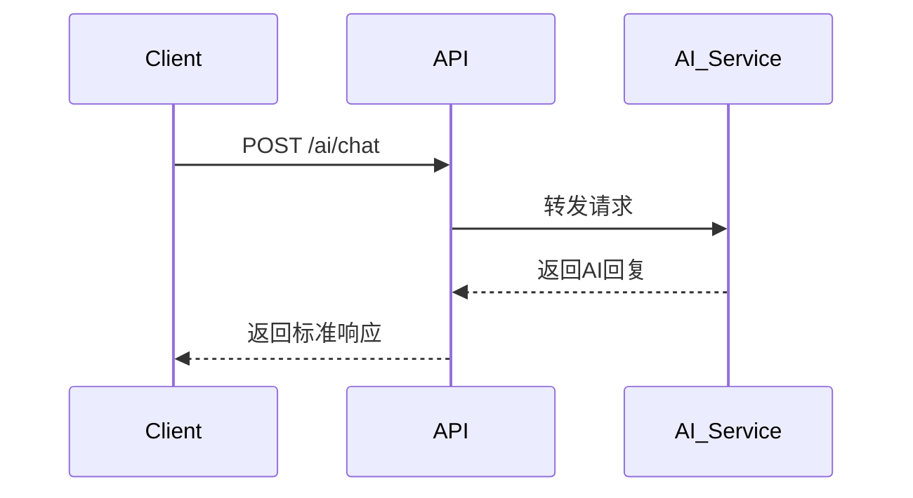

# AI模块API文档

## 📖 概述

AI模块提供智能对话、模型管理、对话历史等功能的API接口。所有接口均遵循项目统一的响应格式规范。

## 🔗 基础信息

**基础URL：** `/api/ai`  
**认证方式：** Bearer Token  
**内容类型：** `application/json`

## 📋 接口列表

### 1. AI聊天对话

**接口名称：** AI聊天对话  
**功能描述：** 发送消息到AI模型并获取智能回复  
**接口地址：** `/ai/chat`  
**请求方式：** POST

#### 功能说明

用户发送消息到指定的AI模型，系统返回AI生成的回复内容。支持多种模型选择和参数配置。



#### 请求参数

```json
{
  "message": "你好，请介绍一下人工智能的发展历程",
  "conversation_id": "conv_123456",
  "model": "gpt-3.5-turbo",
  "temperature": 0.7,
  "max_tokens": 2048,
  "stream": false
}
```

| 参数名 | 类型 | 必填 | 说明 | 示例值 |
|-------|------|-----|------|--------|
| message | string | 是 | 用户消息内容（1-4000字符） | "你好，请介绍一下人工智能" |
| conversation_id | string | 否 | 对话ID，用于关联上下文 | "conv_123456" |
| model | string | 否 | AI模型名称（默认gpt-3.5-turbo） | "gpt-4" |
| temperature | number | 否 | 创造性参数（0-2，默认0.7） | 0.8 |
| max_tokens | number | 否 | 最大输出token数（1-4096，默认2048） | 1024 |
| stream | boolean | 否 | 是否启用流式传输（默认false） | true |

#### 响应参数

**成功响应示例：**
```json
{
  "code": 200,
  "msg": "success",
  "data": {
    "message": "人工智能（AI）的发展历程可以追溯到20世纪50年代...",
    "conversation_id": "conv_123456",
    "model": "gpt-3.5-turbo",
    "usage": {
      "prompt_tokens": 15,
      "completion_tokens": 150,
      "total_tokens": 165
    }
  }
}
```

**错误响应示例：**
```json
{
  "code": 400,
  "msg": "消息内容不能为空",
  "data": null
}
```

**响应字段说明：**

| 参数名 | 类型 | 必填 | 说明 | 示例值 |
|-------|------|-----|------|--------|
| code | int | 是 | 状态码 | 200 |
| msg | string | 是 | 状态信息 | "success" |
| data | object | 是 | 业务数据 | {} |
| data.message | string | 是 | AI回复内容 | "人工智能的发展..." |
| data.conversation_id | string | 是 | 对话ID | "conv_123456" |
| data.model | string | 是 | 使用的模型名称 | "gpt-3.5-turbo" |
| data.usage | object | 是 | Token使用统计 | {} |
| data.usage.prompt_tokens | int | 是 | 输入token数 | 15 |
| data.usage.completion_tokens | int | 是 | 输出token数 | 150 |
| data.usage.total_tokens | int | 是 | 总token数 | 165 |

---

### 2. 流式AI聊天

**接口名称：** 流式AI聊天  
**功能描述：** 通过WebSocket或SSE实现实时流式AI对话  
**接口地址：** `/ai/chat/stream`  
**请求方式：** WebSocket/SSE

#### 功能说明

建立WebSocket连接或SSE连接，实现AI回复的实时流式传输，用户可以看到AI逐字生成的回复过程。

#### WebSocket连接

**连接地址：** `ws://localhost:3000/api/ai/chat/stream`

**发送消息格式：**
```json
{
  "type": "ai_chat_stream",
  "data": {
    "message": "请解释量子计算的原理",
    "conversation_id": "conv_123456",
    "model": "gpt-4",
    "temperature": 0.7,
    "stream": true
  }
}
```

**接收消息格式：**
```json
{
  "type": "ai_chat_chunk",
  "data": {
    "id": "chunk_001",
    "object": "chat.completion.chunk",
    "created": 1699123456,
    "model": "gpt-4",
    "choices": [
      {
        "index": 0,
        "delta": {
          "content": "量子计算是一种"
        },
        "finish_reason": null
      }
    ]
  }
}
```

#### SSE连接

**连接地址：** `GET /api/ai/chat/stream`

**触发流式响应：**
```javascript
// 先建立SSE连接
const eventSource = new EventSource('/api/ai/chat/stream');

// 然后通过POST请求触发流式响应
fetch('/api/ai/chat/stream', {
  method: 'POST',
  headers: { 'Content-Type': 'application/json' },
  body: JSON.stringify({
    message: "请解释量子计算",
    stream: true
  })
});
```

---

### 3. 获取AI模型列表

**接口名称：** 获取AI模型列表  
**功能描述：** 获取当前系统支持的所有AI模型  
**接口地址：** `/ai/models`  
**请求方式：** GET

#### 请求参数

无

#### 响应参数

**成功响应示例：**
```json
{
  "code": 200,
  "msg": "success",
  "data": [
    "gpt-3.5-turbo",
    "gpt-4",
    "gpt-4-turbo",
    "claude-3-sonnet"
  ]
}
```

**响应字段说明：**

| 参数名 | 类型 | 必填 | 说明 | 示例值 |
|-------|------|-----|------|--------|
| code | int | 是 | 状态码 | 200 |
| msg | string | 是 | 状态信息 | "success" |
| data | array | 是 | 可用模型列表 | ["gpt-3.5-turbo", "gpt-4"] |

---

### 4. 获取对话历史消息

**接口名称：** 获取对话历史消息  
**功能描述：** 获取指定对话的历史消息记录  
**接口地址：** `/ai/conversations/{conversationId}/history`  
**请求方式：** GET

#### 请求参数

**路径参数：**
| 参数名 | 类型 | 必填 | 说明 | 示例值 |
|-------|------|-----|------|--------|
| conversationId | string | 是 | 对话ID | "conv_123456" |

**查询参数：**
| 参数名 | 类型 | 必填 | 说明 | 示例值 |
|-------|------|-----|------|--------|
| page | int | 否 | 页码（默认1） | 2 |
| page_size | int | 否 | 每页数量（默认20，最大100） | 50 |

#### 响应参数

**成功响应示例：**
```json
{
  "code": 200,
  "msg": "success",
  "data": {
    "conversation_id": "conv_123456",
    "total": 25,
    "page": 1,
    "page_size": 20,
    "messages": [
      {
        "id": "msg_001",
        "role": "user",
        "content": "你好",
        "timestamp": "2024-01-15T10:30:00Z"
      },
      {
        "id": "msg_002",
        "role": "assistant",
        "content": "您好！有什么可以帮助您的吗？",
        "timestamp": "2024-01-15T10:30:05Z",
        "model": "gpt-3.5-turbo",
        "usage": {
          "prompt_tokens": 5,
          "completion_tokens": 12,
          "total_tokens": 17
        }
      }
    ]
  }
}
```

---

### 5. 删除对话

**接口名称：** 删除对话  
**功能描述：** 删除指定对话及其所有历史记录  
**接口地址：** `/ai/conversations/{conversationId}/delete`  
**请求方式：** POST

#### 请求参数

**路径参数：**
| 参数名 | 类型 | 必填 | 说明 | 示例值 |
|-------|------|-----|------|--------|
| conversationId | string | 是 | 对话ID | "conv_123456" |

#### 响应参数

**成功响应示例：**
```json
{
  "code": 200,
  "msg": "success",
  "data": null
}
```

---

### 6. 获取对话列表

**接口名称：** 获取对话列表  
**功能描述：** 获取当前用户的所有对话列表  
**接口地址：** `/ai/conversations`  
**请求方式：** GET

#### 请求参数

**查询参数：**
| 参数名 | 类型 | 必填 | 说明 | 示例值 |
|-------|------|-----|------|--------|
| page | int | 否 | 页码（默认1） | 1 |
| page_size | int | 否 | 每页数量（默认15） | 15 |

#### 响应参数

**成功响应示例：**
```json
{
  "code": 200,
  "msg": "success",
  "data": {
    "total": 2,
    "conversations": [
      {
        "id": "conv_123",
        "title": "关于机器学习的讨论",
        "last_message_time": "2024-05-20T10:00:00Z"
      },
      {
        "id": "conv_456",
        "title": "解释一下Transformer架构",
        "last_message_time": "2024-05-19T15:30:00Z"
      }
    ]
  }
}
```

---

## 🧩 前端调用逻辑与错误处理（对齐 `sa/src/api/AiApi.ts`）

为了在右侧AI面板实现“设置（模型/温度）”“对话历史”“删除对话”等功能，前端定义了一个请求封装器，统一校验与合并默认配置。

### 默认配置与合并
- 位置：`AiRequestWrapper`（单例）
- 默认：`model=gpt-3.5-turbo`、`temperature=0.7`、`max_tokens=2048`、`stream=false`
- 行为：发送请求时将用户设置与默认配置合并，并进行参数校验（长度、范围、枚举）。

### 主要方法
- `sendChatRequest(params: AiChatRequest)` → POST `/ai/chat`
- `getAvailableModels()` → GET `/ai/models`
- `getConversationList(page=1, pageSize=15)` → GET `/ai/conversations`
- `getConversationHistory(conversationId, page=1, pageSize=20)` → GET `/ai/conversations/{id}/history`
- `deleteConversation(conversationId)` → POST `/ai/conversations/{id}/delete`

### 校验规则（摘要）
- `message`: 非空字符串，长度≤4000，去除空白后仍需非空。
- `temperature`: 数字范围 0–2。
- `max_tokens`: 整数范围 1–4096。
- `model`: 必须在可用枚举中（`gpt-3.5-turbo`, `gpt-4`, `gpt-4-turbo`, `claude-3-sonnet`）。

### 前端使用示例

```ts
import { sendChatRequest, getAvailableModels, getConversationList, getConversationHistory, deleteConversation, AiModel } from '@/api/AiApi'

// 发送消息（携带模型与温度）
await sendChatRequest({
  message: '请总结本页核心内容',
  conversation_id: currentConversationId || undefined,
  model: AiModel.GPT_4,
  temperature: 0.8
})

// 打开设置时获取模型列表
const models = (await getAvailableModels()).data

// 打开历史记录时，获取对话列表
const conversationList = (await getConversationList()).data

// 加载指定对话的历史消息
const history = (await getConversationHistory(currentConversationId, 1, 50)).data

// 删除当前对话
await deleteConversation(currentConversationId)
```

### 错误处理
- API请求失败时会抛出异常；前端应捕获并提示，例如“网络错误”“参数校验失败”。
- 历史与删除操作需校验 `conversationId` 非空；为空时不发起请求，仅提示用户。

### 性能与并发
- 大量历史消息返回时建议分页（`page/page_size`）；前端限制每次最多50条展示，滚动加载。
- 并发发送请求时应串行化写消息列表，防止顺序错乱；每次发送后将滚动定位到底部。

## 🚨 错误代码对照表

| 错误代码 | 错误信息 | 说明 | 解决方案 |
|---------|---------|------|---------|
| 400 | 消息内容不能为空 | 请求参数message为空或无效 | 检查message参数 |
| 400 | 消息内容不能超过4000个字符 | 消息内容过长 | 缩短消息内容 |
| 400 | temperature参数必须是0-2之间的数字 | temperature参数值无效 | 设置正确的temperature值 |
| 400 | max_tokens参数必须是1-4096之间的整数 | max_tokens参数值无效 | 设置正确的max_tokens值 |
| 400 | model参数必须是支持的模型之一 | 指定的模型不支持 | 使用支持的模型名称 |
| 401 | 未授权，请重新登录 | Token无效或过期 | 重新登录获取新Token |
| 403 | AI服务访问受限 | 用户权限不足 | 联系管理员开通权限 |
| 404 | 对话不存在 | 指定的conversation_id不存在 | 检查conversation_id是否正确 |
| 409 | 对话正在进行中 | 同一对话有其他请求正在处理 | 等待当前请求完成 |
| 429 | 请求频率过高 | 超出API调用限制 | 降低请求频率 |
| 500 | AI服务暂时不可用 | AI服务内部错误 | 稍后重试或联系技术支持 |
| 503 | AI服务过载 | 服务器负载过高 | 稍后重试 |

## 🔧 使用示例

### JavaScript/TypeScript示例

```typescript
import { sendAiChat, getAiModels } from '@/api/AiApi'

// 发送AI聊天请求
async function chatWithAI() {
  try {
    const response = await sendAiChat({
      message: "请解释什么是机器学习",
      model: "gpt-3.5-turbo",
      temperature: 0.7
    })
    
    console.log('AI回复:', response.data.message)
    console.log('Token使用:', response.data.usage)
  } catch (error) {
    console.error('聊天失败:', error)
  }
}

// 获取可用模型
async function getModels() {
  try {
    const response = await getAiModels()
    console.log('可用模型:', response.data)
  } catch (error) {
    console.error('获取模型失败:', error)
  }
}
```

### 流式传输示例

```typescript
import { createWebSocketStream } from '@/api/AiStreamingService'

// WebSocket流式聊天
function startStreamChat() {
  const wsStream = createWebSocketStream(
    { url: 'ws://localhost:3000/api/ai/chat/stream' },
    {
      onOpen: () => console.log('连接已建立'),
      onMessage: (chunk) => {
        const content = aiResponseHandler.extractStreamContent(chunk)
        console.log('接收到内容:', content)
        
        if (aiResponseHandler.isStreamFinished(chunk)) {
          console.log('流式传输完成')
        }
      },
      onError: (error) => console.error('连接错误:', error),
      onClose: () => console.log('连接已关闭')
    }
  )
  
  // 建立连接
  wsStream.connect().then(() => {
    // 发送消息
    wsStream.sendStreamRequest({
      message: "请详细解释深度学习的原理",
      stream: true
    })
  })
}
```

## 📝 注意事项

1. **认证要求**：所有API请求都需要在Header中包含有效的Bearer Token
2. **请求限制**：每个用户每分钟最多发送60次请求
3. **消息长度**：单次消息内容不能超过4000个字符
4. **并发限制**：同一对话同时只能有一个请求在处理
5. **流式传输**：使用流式传输时需要正确处理连接断开和重连
6. **错误处理**：建议实现完整的错误处理和重试机制
7. **Token管理**：注意监控Token使用量，避免超出配额

## 🔄 版本更新

**当前版本：** v1.0.0  
**更新时间：** 2024-01-15

### 版本历史

- **v1.0.0** (2024-01-15)
  - 初始版本发布
  - 支持基础AI聊天功能
  - 支持WebSocket和SSE流式传输
  - 支持多模型选择
  - 支持对话历史管理