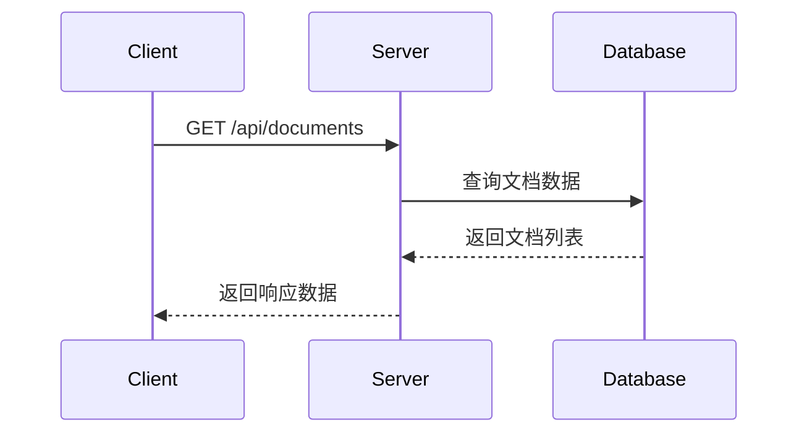

# 文档管理接口

## 获取文档列表

**接口名称：** 获取文档列表  
**功能描述：** 分页获取文档列表，支持分类筛选和搜索  
**接口地址：** `/api/documents`  
**请求方式：** GET

### 功能说明

该接口用于获取系统中的文档列表，支持按分类筛选、关键词搜索和分页查询。可用于工作台文档展示、分类浏览等场景。



### 请求参数

| 参数名 | 类型 | 必填 | 说明 | 示例值 |
|-------|------|-----|------|--------|
| category_id | string | 否 | 分类ID，不传或传"all"表示获取全部 | "cat_1" |
| search | string | 否 | 搜索关键词，支持标题、摘要搜索 | "transformer" |
| page | int | 否 | 页码，从1开始（默认1） | 2 |
| pageSize | int | 否 | 每页数量（默认10，最大100） | 20 |

### 响应参数

**成功响应示例：**
```json
{
  "code": 200,
  "msg": "success",
  "data": [
    {
      "id": "doc_1",
      "title": "Attention Is All You Need",
      "filename": "attention_is_all_you_need.pdf",
      "category_id": "cat_2",
      "upload_date": "2024-01-15T10:30:00Z",
      "file_size": "2.3 MB",
      "pages": 15,
      "status": "ready",
      "thumbnail": "https://example.com/thumbnail.jpg",
      "abstract": "The dominant sequence transduction models...",
      "tags": ["transformer", "attention", "nlp"],
      "read_progress": 0.6
    }
  ]
}
```

**错误响应示例：**
```json
{
  "code": 400,
  "msg": "页码参数错误",
  "data": null
}
```

**响应字段说明：**

| 参数名 | 类型 | 必填 | 说明 | 示例值 |
|-------|------|-----|------|--------|
| code | int | 是 | 状态码 | 200 |
| msg | string | 是 | 状态信息 | "success" |
| data | array | 是 | 文档列表数据 | [] |
| data[].id | string | 是 | 文档唯一标识 | "doc_1" |
| data[].title | string | 是 | 文档标题 | "Attention Is All You Need" |
| data[].filename | string | 是 | 文件名 | "attention_is_all_you_need.pdf" |
| data[].category_id | string | 是 | 所属分类ID | "cat_2" |
| data[].upload_date | string | 是 | 上传时间（ISO格式） | "2024-01-15T10:30:00Z" |
| data[].file_size | string | 是 | 文件大小 | "2.3 MB" |
| data[].pages | int | 是 | 页数 | 15 |
| data[].status | string | 是 | 处理状态：ready/processing | "ready" |
| data[].thumbnail | string | 是 | 缩略图URL | "https://example.com/thumbnail.jpg" |
| data[].abstract | string | 是 | 摘要 | "The dominant sequence..." |
| data[].tags | array | 是 | 标签列表 | ["transformer", "attention"] |
| data[].read_progress | float | 是 | 阅读进度（0-1） | 0.6 |

### 接口权限要求
- 需要用户登录
- 无特殊权限限制

### 接口调用频率限制
- 每分钟最多100次请求

---

## 获取文档详情

**接口名称：** 获取文档详情  
**功能描述：** 根据文档ID获取文档详细信息  
**接口地址：** `/api/documents/{id}`  
**请求方式：** GET

### 功能说明

根据文档ID获取单个文档的详细信息，用于文档阅读页面、详情展示等场景。

### 请求参数

**路径参数：**

| 参数名 | 类型 | 必填 | 说明 | 示例值 |
|-------|------|-----|------|--------|
| id | string | 是 | 文档ID | "doc_1" |

### 响应参数

**成功响应示例：**
```json
{
  "code": 200,
  "msg": "success",
  "data": {
    "id": "doc_1",
    "title": "Attention Is All You Need",
    "filename": "attention_is_all_you_need.pdf",
    "category_id": "cat_2",
    "upload_date": "2024-01-15T10:30:00Z",
    "file_size": "2.3 MB",
    "pages": 15,
    "status": "ready",
    "thumbnail": "https://example.com/thumbnail.jpg",
    "abstract": "The dominant sequence transduction models...",
    "tags": ["transformer", "attention", "nlp"],
    "read_progress": 0.6,
    "preview_url": "/api/files/documents/doc_1/download"
  }
}
```

**错误响应示例：**
```json
{
  "code": 404,
  "msg": "文档不存在",
  "data": null
}
```

### 接口权限要求
- 需要用户登录
- 只能查看自己上传的文档

### 预览说明
- 前端使用 `preview_url` 加载 PDF，服务端返回 `Content-Type: application/pdf` 且 `Content-Disposition: inline`，可在 `<iframe>` 或 PDF.js 中直接阅读。

---

## 上传文档

**接口名称：** 上传文档  
**功能描述：** 上传PDF文档并进行解析处理  
**接口地址：** `/api/documents/upload`  
**请求方式：** POST

### 功能说明

支持用户上传PDF文档，系统会自动进行文档解析、缩略图生成等处理。上传后文档状态为"processing"，处理完成后变为"ready"。

### 请求参数

**请求体参数（multipart/form-data）：**

| 参数名 | 类型 | 必填 | 说明 | 示例值 |
|-------|------|-----|------|--------|
| file | File | 是 | PDF文件，最大50MB | - |
| title | string | 否 | 文档标题，不传则使用文件名 | "深度学习论文" |
| category_id | string | 否 | 分类ID，不传则放入默认分类 | "cat_1" |

### 响应参数

**成功响应示例：**
```json
{
  "code": 200,
  "msg": "success",
  "data": {
    "id": "doc_123456789",
    "title": "新上传文档",
    "filename": "document.pdf",
    "category_id": "cat_1",
    "upload_date": "2024-01-21T10:30:00Z",
    "file_size": "1.5 MB",
    "pages": 10,
    "status": "processing",
    "thumbnail": "https://example.com/default-thumbnail.jpg",
    "abstract": "文档正在处理中...",
    "tags": [],
    "read_progress": 0
  }
}
```

**错误响应示例：**
```json
{
  "code": 400,
  "msg": "文件格式不支持，仅支持PDF格式",
  "data": null
}
```

### 接口权限要求
- 需要用户登录
- 需要上传权限

### 接口调用频率限制
- 每小时最多上传20个文件

---

## 更新阅读进度

**接口名称：** 更新阅读进度  
**功能描述：** 更新文档的阅读进度  
**接口地址：** `/api/documents/{id}/progress`  
**请求方式：** POST

### 功能说明

用于记录用户的文档阅读进度，支持断点续读功能。

### 请求参数

**路径参数：**

| 参数名 | 类型 | 必填 | 说明 | 示例值 |
|-------|------|-----|------|--------|
| id | string | 是 | 文档ID | "doc_1" |

**请求体参数：**
```json
{
  "progress": 0.75
}
```

| 参数名 | 类型 | 必填 | 说明 | 示例值 |
|-------|------|-----|------|--------|
| progress | float | 是 | 阅读进度，范围0-1 | 0.75 |

### 响应参数

**成功响应示例：**
```json
{
  "code": 200,
  "msg": "success",
  "data": {
    "progress": 0.75
  }
}
```

**错误响应示例：**
```json
{
  "code": 400,
  "msg": "进度值必须在0-1之间",
  "data": null
}
```

---

## 删除文档

**接口名称：** 删除文档  
**功能描述：** 删除指定的文档  
**接口地址：** `/api/documents/{id}/delete`  
**请求方式：** POST

### 功能说明

删除用户上传的文档，包括文件本体、缩略图、相关笔记等数据。删除操作不可恢复。

### 请求参数

**路径参数：**

| 参数名 | 类型 | 必填 | 说明 | 示例值 |
|-------|------|-----|------|--------|
| id | string | 是 | 文档ID | "doc_1" |

### 响应参数

**成功响应示例：**
```json
{
  "code": 200,
  "msg": "success",
  "data": null
}
```

**错误响应示例：**
```json
{
  "code": 404,
  "msg": "文档不存在",
  "data": null
}
```

### 接口权限要求
- 需要用户登录
- 只能删除自己上传的文档

### 相关业务规则说明
- 删除文档会同时删除相关的笔记和标注
- 删除操作不可恢复，请谨慎操作
- 正在处理中的文档不能删除